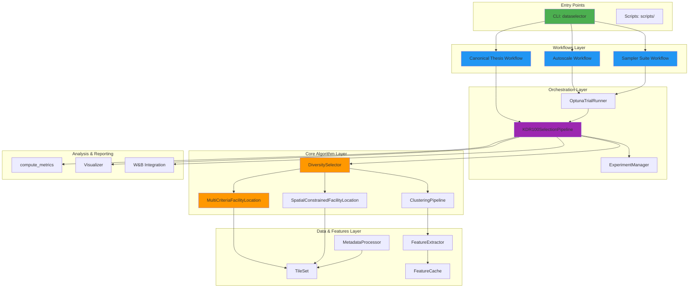

# Architecture Overview: Dataselector System Design

**Version:** 1.0  
**Date:** 2. Februar 2026  
**Status:** Stable (Post Phase-4 Migration)

## Table of Contents

1. [Overview](#overview)
2. [High-Level Architecture](#high-level-architecture)
3. [Component Details](#component-details)
4. [Data Flow](#data-flow)
5. [Configuration System](#configuration-system)
6. [API Structure](#api-structure)
7. [Extension Points](#extension-points)

---

## Overview

Dataselector implementiert eine **algorithmische Datenselektion** für die Karte des Deutschen Reiches (KDR100) mittels:

- **Unsupervised Deep Clustering** (DINOv2/ResNet50 + UMAP + K-Means)
- **Multi-Criteria Facility Location Selection** (submodulare Optimierung)
- **Bayesian Hyperparameter Optimization** (Optuna + QMC/TPE/CMA-ES)

### Projektstruktur: Modern API

```
dataselector/           # ✅ Modern API (stable, Phase-4 complete)
├── analysis/           # Clustering, Metriken, Visualisierung
├── data/               # TileSet Management, Metadaten-Parsing
├── features/           # Feature-Extraktion (DL), Caching
├── selection/          # Diversity-Sampling-Algorithmen
├── pipeline/           # Experiment-Management, Orchestrierung
├── workflows/          # CLI-Integration, 3-Phasen-Pipeline
├── cli.py              # Unified CLI Entry Point
└── __init__.py         # Public API (re-exports)

scripts/                # 🚀 Execution Scripts (invoked via CLI)
config/                 # 📋 YAML Configurations
tests/                  # 🧪 Test Suite (89 tests passing)
```

---

## High-Level Architecture

### System Components



### Three-Phase Optimization Pipeline

```
┌─────────────────────────────────────────────────────────────┐
│ PHASE 1: Autoscale (find optimal n_samples + weights)       │
│   Method: Optuna CMA-ES                                     │
│   Output: optuna_autoscale_best_latest.json                 │
└─────────────────────────────────────────────────────────────┘
                            ↓
┌─────────────────────────────────────────────────────────────┐
│ PHASE 2: Sampler Suite (compare QMC vs TPE vs CMA-ES)       │
│   Method: Multi-seed evaluation (5 seeds, 50 trials each)   │
│   Output: selected_sampler.json                             │
└─────────────────────────────────────────────────────────────┘
                            ↓
┌─────────────────────────────────────────────────────────────┐
│ PHASE 3: XXL Pipeline (full thesis workflow)                │
│   Phase 0: Convergence analysis                             │
│   Phase 1-4: Optimization on full dataset                   │
│   Phase 5: Bootstrap uncertainty quantification             │
└─────────────────────────────────────────────────────────────┘
```

---

## Component Details

### 1. Data Layer (`dataselector/data/`)

#### MetadataProcessor
**Zweck:** Lädt und verarbeitet Tile-Metadaten (CSV/DBF), extrahiert spatio-temporale Attribute.

**Hauptfunktionen:**
- `load_metadata(path)`: Liest CSV/DBF, konvertiert Datumsfelder
- `extract_coordinates()`: Parst WGS84-Koordinaten oder projected (EPSG:25832)
- `extract_temporal()`: Extrahiert Jahre/Zeitstempel aus `jahr_von`/`jahr_bis`

**Unterstützte Formate:**
- CSV mit WGS84-Spalten (`long`, `lat`)
- DBF (Legacy) mit UTM-Koordinaten (`x_unten_li`, `y_unten_li`)

#### TileSet
**Zweck:** Datencontainer mit Provenance-Tracking, hält Metadaten + Features + Selektion.

**Attribute:**
- `metadata`: pandas.DataFrame (Tile-Metadaten)
- `features`: np.ndarray (Deep Learning Features, optional)
- `selected_indices`: List[int] (Ausgewählte Samples)
- `provenance`: Dict (Tracking-Informationen)

---

### 2. Features Layer (`dataselector/features/`)

#### FeatureExtractor
**Zweck:** Deep Learning Feature-Extraktion mit Modellauswahl.

**Unterstützte Modelle:**
- **ResNet50** (ImageNet1K_V1 Weights) – Default, schnell, robust
- **DINOv2** (Vision Transformer) – Experimentell, bessere Repräsentationen

**Memory Management:**
- GPU-Acceleration: `device='cuda'` (falls verfügbar)
- CPU-Fallback: `device='cpu'`
- Auto-Detection: `device='auto'`

**Batch-Processing:**
- `batch_size=8` (default, reduziert bei OOM)
- Gradient-Deaktivierung: `torch.no_grad()`

#### FeatureCache
**Zweck:** Hash-basiertes Caching für wiederholte Runs.

**Identifikation:**
- Hash: `(image_paths + model_name + crop_size)`
- Speicherformat: `.npy` (NumPy Arrays)
- Speicherort: `outputs/features/<hash>.npy`

**Invalidierung:**
- Automatisch bei Modellwechsel
- Manuell via `--force-recompute`

---

### 3. Selection Layer (`dataselector/selection/`)

#### DiversitySelector
**Zweck:** Haupteinstiegspunkt für diverse Sampling-Algorithmen.

**Methoden:**
1. `select_multi_criteria()` → `MultiCriteriaFacilityLocation`
2. `select_spatial_constrained()` → `SpatialConstrainedFacilityLocation`
3. `select_clustering_based()` → `ClusteringPipeline`

#### MultiCriteriaFacilityLocation
**Zweck:** Gewichtete Kombination von visueller, räumlicher und zeitlicher Diversität.

**Objective Function:**
$$D(i,j) = \alpha \cdot D_{\text{visual}}(i,j) + \beta \cdot D_{\text{spatial}}(i,j) + \gamma \cdot D_{\text{temporal}}(i,j)$$

**Constraints:**
- $\alpha + \beta + \gamma = 1$ (Normalisierung via `_normalize_weights()`)
- $\alpha, \beta, \gamma \in [0, 1]$

**Normalisierung der Distanzen:**
- Jede Distanzmatrix wird auf [0, 1] skaliert
- Gewichtete Kombination: `D_combined = alpha·D_visual + beta·D_spatial + gamma·D_temporal`

**Facility Location Solver:**
- Backend: `apricot-select` (Submodular Optimization)
- Algorithmus: Lazy Greedy mit Matroidkonstraints
- Komplexität: $O(n \cdot k)$

**Temporal Dimension Replication:**
- Lösung: Repliziere 1D-Zeitdimension in 2D-Raum für konsistente Distanzberechnung

#### SpatialConstrainedFacilityLocation
**Zweck:** Integriert räumliche Mindestabstände direkt in Facility Location.

**Haversine-Distanz:**
$$d = 2 \cdot R \cdot \arcsin\left(\sqrt{\sin^2\left(\frac{\Delta\phi}{2}\right) + \cos(\phi_1) \cdot \cos(\phi_2) \cdot \sin^2\left(\frac{\Delta\lambda}{2}\right)}\right)$$

**Fallback-Mechanismen:**
1. **Adaptive Relaxation:** Reduziere `min_distance_km` um 10% pro Iteration
2. **Hard Constraint:** Falls keine Kandidaten, breche ab mit Warnung

**Projected vs. Geographic Coordinates:**
- Geographic (WGS84): Haversine-Distanz
- Projected (EPSG:25832): Euklidische Distanz (schneller, weniger präzise)
- Auto-Detection: Basierend auf Koordinatenbereich

---

### 4. Analysis Layer (`dataselector/analysis/`)

#### ClusteringPipeline
**Zweck:** UMAP Dimensionsreduktion + K-Means Clustering.

**UMAP-Parameter:**
- `n_components=2`: Reduktion auf 2D für Visualisierung
- `n_neighbors=15`: Lokale Nachbarschaft
- `min_dist=0.1`: Minimaler Abstand in Einbettung
- `metric='cosine'`: Distanzmetrik
- `random_state=2026`: Seed für Reproduzierbarkeit

**K-Means-Parameter:**
- `n_clusters=8`: Anzahl Cluster (empirisch validiert für KDR100)
- `random_state=42`: Seed für konsistente Initialisierung

#### compute_metrics()
**Metriken:**

| Kategorie | Metrik | Beschreibung |
|-----------|--------|-------------|
| **Spatial** | Mean Distance | $\bar{d} = \frac{1}{n(n-1)} \sum_{i \neq j} d(i,j)$ |
| | Std Distance | Standardabweichung der Distanzen |
| | Min Distance | $d_{\min} = \min_{i \neq j} d(i,j)$ |
| **Temporal** | Year Range | max(year) - min(year) |
| | Std Year | Standardabweichung der Jahre |
| **Visual** | Intra-Cluster Diversity | Feature-Distanz innerhalb Cluster |
| | Inter-Cluster Balance | Shannon-Entropie der Cluster-Verteilung |

#### Visualizer
**Zweck:** Matplotlib-basierte Plots für Ergebnisse.

**Plot-Typen:**
1. **Spatial Distribution:** Scatterplot (Longitude × Latitude)
2. **Temporal Histogram:** Jahresverteilung
3. **Cluster Assignment:** UMAP-Embedding mit Farben
4. **Selection Overview:** Kombinierter Multi-Panel-Plot

**Export-Formate:**
- PNG (300 DPI, publication-ready)
- PDF (Vector, editierbar)
- SVG (Web-Integration)

---

### 5. Pipeline Layer (`dataselector/pipeline/`)

#### ExperimentManager
**Zweck:** Versionierung, Provenance-Tracking, Result-Logging.

**Features:**
- Run-Verzeichnisse: `outputs/runs/YYYYMMDD_THHMMSS_<name>/`
- Provenance-JSON: Config + Params + Git-Hash + Timestamp
- Result-Serialization: JSON/CSV/NPY für Metriken/Features/Selections

#### OptunaTrialRunner
**Zweck:** Wrapper für Optuna Trial-Execution.

**Features:**
- Trial-Caching (vermeidet Recomputation)
- Multi-Seed Execution (für robuste Evaluation)
- Failure-Handling (FAIL/INF statt Crash)

#### KDR100SelectionPipeline
**Zweck:** End-to-End-Orchestrator von Daten → Selektion → Evaluation.

**Workflow:**
1. Daten laden
2. Features extrahieren (mit Caching)
3. Diversity-Selektion
4. Metriken berechnen
5. Visualisierungen
6. Resultate speichern

---

### 6. Workflows Layer (`dataselector/workflows/`)

#### Autoscale Workflow
**Script:** `scripts/optuna_autoscale.py`  
**Invocation:** `dataselector autoscale [--n-trials 100] [--seed 42]`

**Zweck:** Findet optimale Kombination von `(n_samples, α, β, γ)` via Bayesian Optimization mit CMA-ES Sampler.

#### Sampler Suite Workflow
**Script:** `scripts/run_thesis_sampler_suite.py`  
**Invocation:** `dataselector sampler-suite [--seeds 5] [--trials-per-sampler 50]`

**Zweck:** Vergleicht **3 Optuna-Sampler** über multiple Seeds:
1. **QMC (Sobol)** – Quasi-Monte Carlo, deterministisch
2. **TPE** – Tree-structured Parzen Estimator, Bayesian
3. **CMA-ES** – Covariance Matrix Adaptation, evolutionär

**Output:** `outputs/selected_sampler.json` (Best Sampler + Stats)

#### Canonical Thesis Workflows
**Entry points:** `dataselector thesis-orchestrate` and `dataselector thesis-pipeline`

**Zweck:** Heutige kanonische Thesis-Pipeline auf `outputs/runs/` mit
vorkonfigurierter Orchestrierung, Snapshot-/Manifest-Artefakten und
run-lokalen Reports.

**Workflow roles:**
- **`thesis-orchestrate`:** Empfohlener End-to-End-Einstieg für Precompute,
  Snapshot, Lauf und Berichtsartefakte in einem kontrollierten Run-Verzeichnis
- **`thesis-pipeline`:** Direkt ausführbarer Thesis-Lauf für gezielte Runs,
  Dry-Runs und reproduzierbare CLI-Ausführung
- **`generate-monitor`:** Run-lokale Zusammenfassung für vorhandene Thesis-Runs
  unter `outputs/runs/<run_id>/`

**Historical note:** Die frühere `xxl`-/`xxl-monitor`-Surface ist archiviert
unter `docs/07_ARCHIVE/legacy_xxl_ops/` und kein aktiver Pipeline-Vertrag mehr.

---

## Data Flow

### End-to-End Pipeline

```
CSV: new_all_tiles.csv  +  Images: data/images/
          ↓                        ↓
    MetadataProcessor      FeatureExtractor
          ↓                        ↓
       TileSet              Features 2048D
          └──────┬──────────────┘
                 ↓
          DiversitySelector
                 ↓
    MultiCriteriaFacilityLocation
    + SpatialConstraint
                 ↓
       Selected Indices
          ↓              ↓            ↓
      Metrics      Visualizations  ExperimentManager
                 ↓
          outputs/runs/YYYYMMDD_THHMMSS/
```

### Configuration Merge Strategy

**Precedence (Highest → Lowest):**
1. **CLI Arguments** (`--n-samples 50`)
2. **Pipeline-Specific Config** (`pipeline_config.bootstrap.yaml`)
3. **Base Config** (`pipeline_config.yaml`)
4. **Code Defaults** (hardcoded in classes)

---

## Configuration System

### YAML Structure (`pipeline_config.yaml`)

```yaml
data:
  metadata_path: "data/new_all_tiles.csv"
  image_dir: "data/images"

feature_extraction:
  model: "dinov2"  # Options: 'resnet50', 'dinov2'
  batch_size: 8
  device: "auto"  # 'cuda', 'cpu', 'auto'

clustering:
  n_clusters: 8
  umap_components: 2
  umap_n_neighbors: 15
  umap_min_dist: 0.1
  umap_metric: "cosine"
  umap_random_state: 2026

selection:
  n_samples: null  # null = adaptive (5%), or set explicitly
  alpha_visual: 0.40
  beta_spatial: 0.30
  gamma_temporal: 0.30
  spatial_constraint: true
  min_distance_km: 40.0
  random_state: 42

output:
  dir: "outputs"
  prefix: "kdr100_selection"
  create_visualizations: true
```

**Validation Rules:**
- `alpha + beta + gamma = 1.0`
- `n_samples ≤ len(tileset)`
- `min_distance_km > 0`

---

## API Structure

### Public API

```python
from dataselector import (
    # Data
    load_tiles,
    load_or_compute_features,
    
    # Selection
    DiversitySelector,
    MultiCriteriaFacilityLocation,
    SpatialConstrainedFacilityLocation,
    
    # Analysis
    ClusteringPipeline,
    compute_metrics,
    Visualizer,
)
```

### Typical Workflow

```python
# 1. Load Data
tileset = load_tiles(
    metadata_path="data/new_all_tiles.csv",
    image_dir="data/images"
)

# 2. Extract Features
features = load_or_compute_features(
    tileset=tileset,
    model="dinov2",
    batch_size=16
)

# 3. Select Diverse Samples
selector = DiversitySelector(tileset)
selected = selector.select_multi_criteria(
    n_samples=50,
    alpha_visual=0.4,
    beta_spatial=0.3,
    gamma_temporal=0.3,
    min_distance_km=40.0
)

# 4. Compute Metrics
metrics = compute_metrics(tileset, selected)

# 5. Visualize
viz = Visualizer()
viz.plot_selection(tileset, selected, save_path="outputs/selection.png")
```

### CLI Commands

```bash
# Phase 1: Autoscale
dataselector autoscale --n-trials 100 --seed 42

# Phase 2: Sampler Suite
dataselector sampler-suite --seeds 5

# Phase 3: Canonical orchestration
dataselector thesis-orchestrate --config config/pipeline_config.yaml

# Direct thesis run
dataselector thesis-pipeline --execution-profile thesis_repro --output-dir outputs/runs/thesis_run

# Final Selection
dataselector final-selection --config outputs/autoscale_best_latest.json

# Compare Samplers
dataselector compare-samplers --samplers qmc tpe cmaes

# Generate monitor summary for a completed thesis run
dataselector generate-monitor --run-dir outputs/runs/YYYYMMDD_THHMMSS
```

---

## Extension Points

### 1. Custom Feature Extractors

```python
from dataselector.features import FeatureExtractor

class CustomFeatureExtractor(FeatureExtractor):
    def extract(self, images: np.ndarray) -> np.ndarray:
        # Your feature extraction logic
        return features
```

### 2. Custom Selection Algorithms

```python
class CustomSelector:
    def select(self, tileset: TileSet, n_samples: int, **kwargs) -> List[int]:
        # Your selection algorithm
        return selected_indices
```

### 3. Custom Metrics

```python
def compute_custom_metrics(tileset: TileSet, selected_indices: List[int]) -> Dict[str, float]:
    # Your metrics computation
    return {"metric_name": value}
```

### 4. Custom Visualizations

```python
class CustomVisualizer(Visualizer):
    def plot_custom(self, tileset: TileSet, selected: List[int], save_path: str):
        # Your visualization logic
        fig.savefig(save_path)
```

---

## Key Innovations

1. **Multi-Criteria Facility Location**: Gewichtete Kombination (visual + spatial + temporal)
2. **Spatial Hard-Constraints**: Garantierte Mindestabstände zwischen Samples
3. **Bayesian Hyperparameter Optimization**: Automatische Parameter-Tuning (Optuna CMA-ES)
4. **3-Sampler Comparison**: QMC vs TPE vs CMA-ES über multiple Seeds
5. **Bootstrap Uncertainty Quantification**: 200 Resamples für Robustheit-Analyse
6. **Experiment Tracking**: W&B Integration für vollständige Provenance

---

**Related Documentation:**
- [Pipeline Guide](../03_USER_GUIDES/PIPELINES.md) – Canonical thesis workflows
- [API Reference](../06_REFERENCE/api_reference.md) – Complete API
- [Scientific Background](../08_GOVERNANCE/SCIENTIFIC_BACKGROUND.md) – Mathematical Foundations
- [Developer Guide](../04_DEVELOPER/DEVELOPER.md) – Contribution Guidelines
- [Historical XXL Details](../07_ARCHIVE/legacy_xxl_ops/XXL_PIPELINE_DETAILED.md) – Archived pre-thesis-orchestrate workflow

---

**Last Updated:** 2. Februar 2026  
**Status:** Production Ready (Post Phase-4 Migration)
